## Experiment 3:- Containerized Web Application with PostgreSQL using Docker Compose and Macvlan/Ipvlan

<hr>

<h4 align="center"> Pre-requisite </h4>

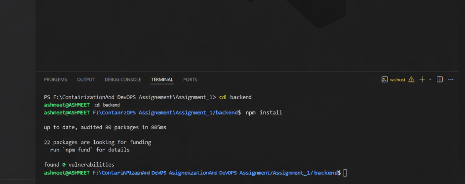

<hr>

**Step-1:- Initialize a Node Package**
```bash
npm init -y
```
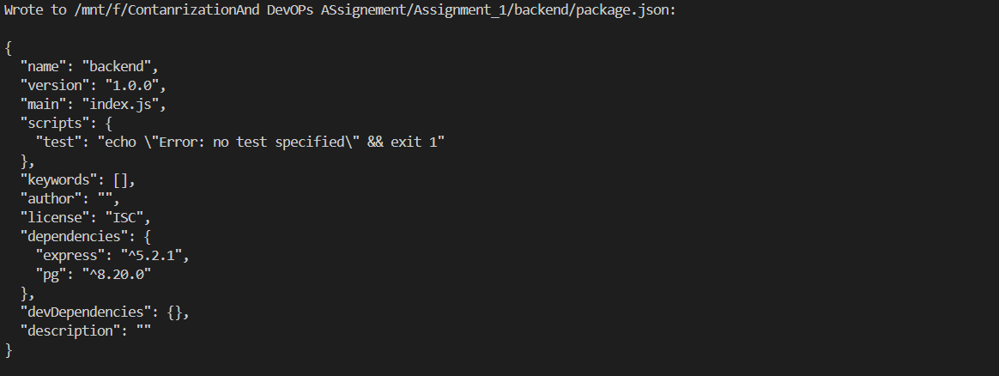


**Step-2:- Install Necessary Package**
```bash
npm i express pg
```
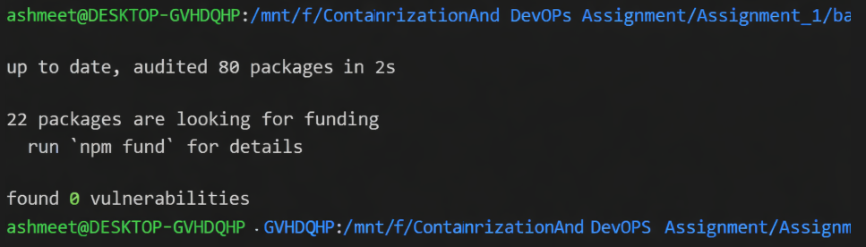


**Step-3:- The `package.json` will look as follows:-**
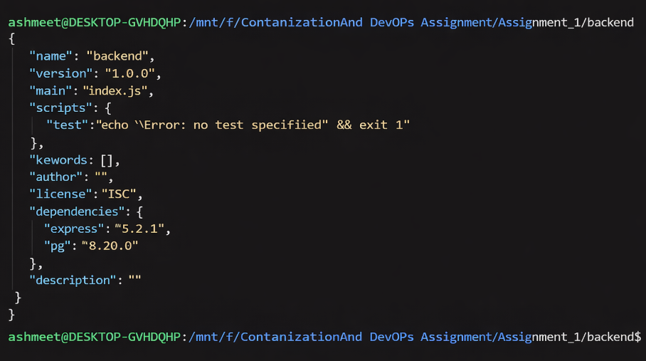


**Step-4:- The `server.js` will look as follows:-**
```js
const express = require("express");
const { Pool } = require("pg");


const app = express();
app.use(express.json());

const pool = new Pool({
  host: process.env.DB_HOST,
  user: process.env.POSTGRES_USER,
  password: process.env.POSTGRES_PASSWORD,
  database: process.env.POSTGRES_DB,
  port: 5432
});

async function initDB() {
  await pool.query(`
    CREATE TABLE IF NOT EXISTS users(
        id SERIAL PRIMARY KEY,
        name TEXT
    )
  `);
}

initDB();

app.get("/health", (req, res) => {
  res.send("Server healthy");
});

app.post("/users", async (req, res) => {
  const { name } = req.body;

  const result = await pool.query(
    "INSERT INTO users(name) VALUES($1) RETURNING *",
    [name]
  );

  res.json(result.rows[0]);
});

app.get("/users", async (req, res) => {
  const result = await pool.query("SELECT * FROM users");
  res.json(result.rows);
});

app.listen(3000, "0.0.0.0", () => {
  console.log("Server running on port 3000");
});
```
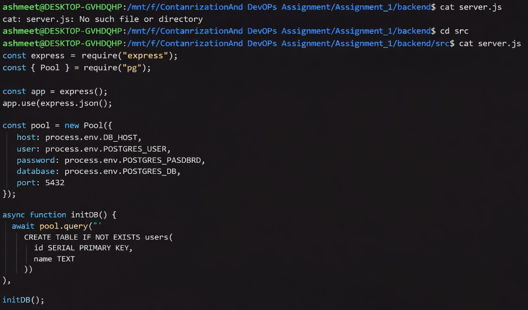
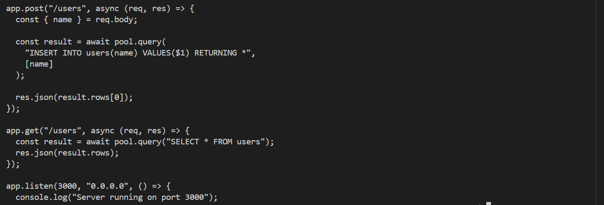


**Step-5:- The backend/`Dockerfile` will look as follows:-**
```Dockerfile
# Builder Stage
FROM node:20-alpine AS builder

WORKDIR /app

COPY package*.json ./

RUN npm install --only=production

COPY . .

# Runtime Stage
FROM node:20-alpine

WORKDIR /app

RUN addgroup -S appgroup && adduser -S appuser -G appgroup

COPY --from=builder /app .

USER appuser

EXPOSE 3000

CMD ["node", "src/server.js"]
```
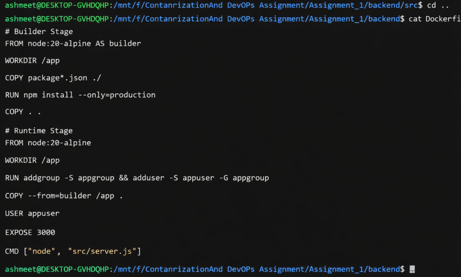


**Step-6:- The `.dockerignore` will look as follows:-**
```bash
node_modules
npm-debug.log
Dockerfile
.git
.gitignore
````


**Step-7:- The database/`Dockerfile` will look as follows:-**
```Dockerfile
FROM postgres:15-alpine

COPY init.sql /docker-entrypoint-initdb.d/
```
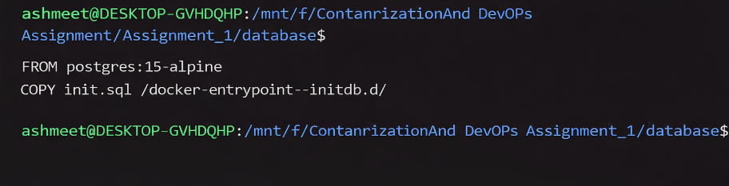


**Step-8:- The `init.sql` will look as follows:-**
```sql
CREATE TABLE IF NOT EXISTS users(
    id SERIAL PRIMARY KEY,
    name TEXT
);
```
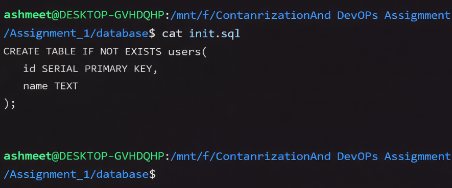


**Step-9:- The `docker-compose.yml` will look as follows:-**
```docker-compose
version: "3.9"

services:

  database:
    build: ./database
    container_name: postgres_db
    restart: always

    environment:
      POSTGRES_DB: mydb
      POSTGRES_USER: admin
      POSTGRES_PASSWORD: dhairya

    volumes:
      - pgdata:/var/lib/postgresql/data

    networks:
      macvlan_net:
        ipv4_address: 192.168.50.21

    healthcheck:
      test: ["CMD-SHELL", "pg_isready -U admin"]
      interval: 10s
      retries: 5


  backend:
    build: ./backend
    container_name: node_backend
    restart: always

    environment:
      DB_HOST: 192.168.50.21
      POSTGRES_DB: mydb
      POSTGRES_USER: admin
      POSTGRES_PASSWORD: dhairya

    depends_on:
      database:
        condition: service_healthy

    networks:
      macvlan_net:
        ipv4_address: 192.168.50.20


volumes:
  pgdata:

networks:
  macvlan_net:
    external: true
```
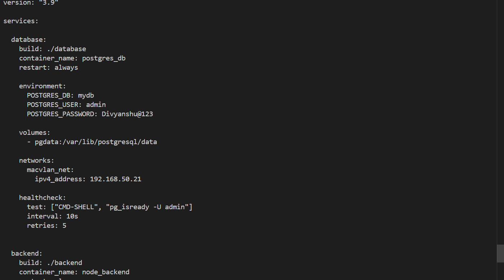


**Step-10:- Find your interface**
```bash
ip a
```
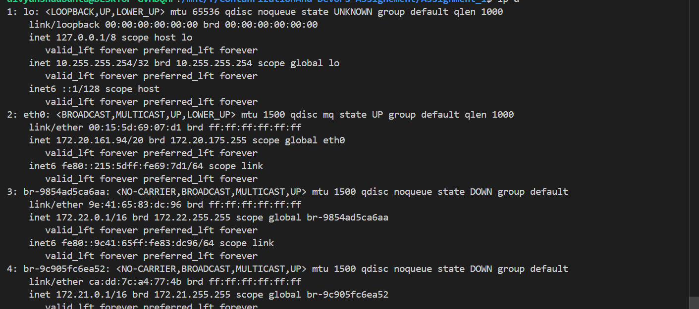


**Step-11:- Create Network**
```bash
docker network create -d macvlan \
  --subnet=192.168.50.0/24 \
  --gateway=192.168.50.1 \
  -o parent=eth0 \
  macvlan_net
```
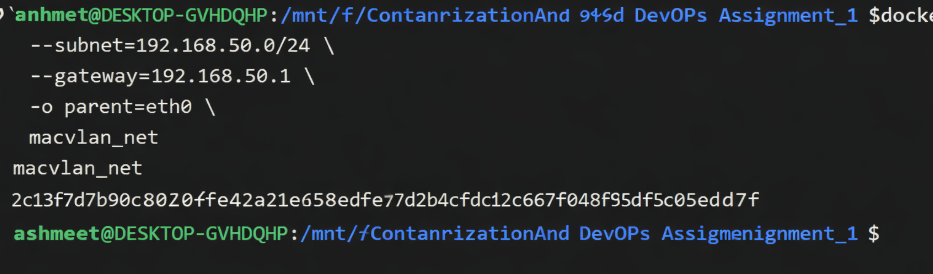


**Step-12:- Build from Compose**
```bash
docker-compose up build --no-cache
```
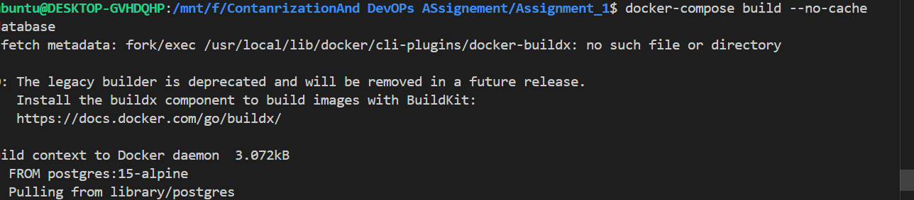


**Step-13:- Start Services**
```bash
docker-compose up -d
```
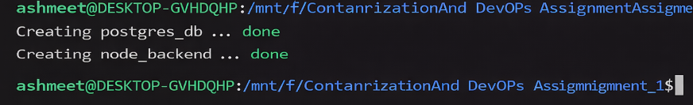


**Step-14:- Insert A User in DB in API**
```bash
curl -X POST http://192.168.50.20:3000/users \
-H "Content-Type: application/json" \
-d '{"name":"Divyanhu Singh "}'
```
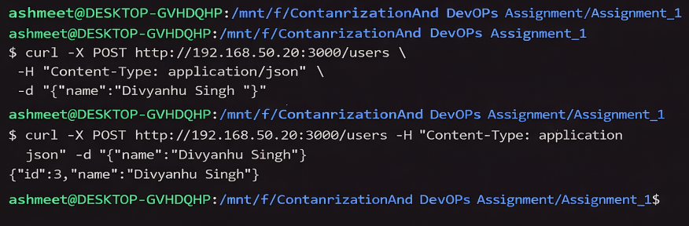


**Step-15:- GET User API**
```bash
curl http://192.168.50.20:3000/users
```
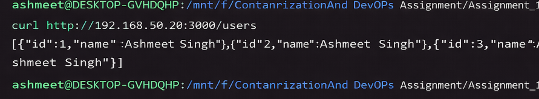


**Step-16:- List Running Container**
```bash
docker ps
```
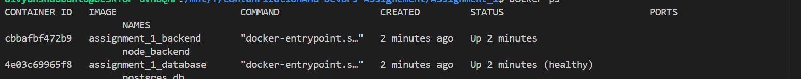


**Step-17:- List Volumes**
```bash
docker volume ls 
```
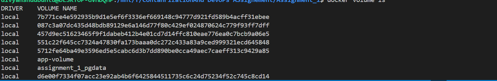


**Step-18:- Inspect Network**
```bash
docker network inspect macvlan_net
```
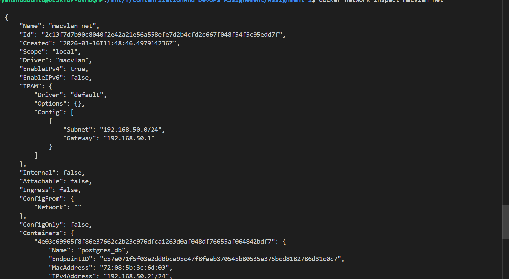


**Step-19:- Inspect Backend Container**
```bash
docker inspect node_backend
```
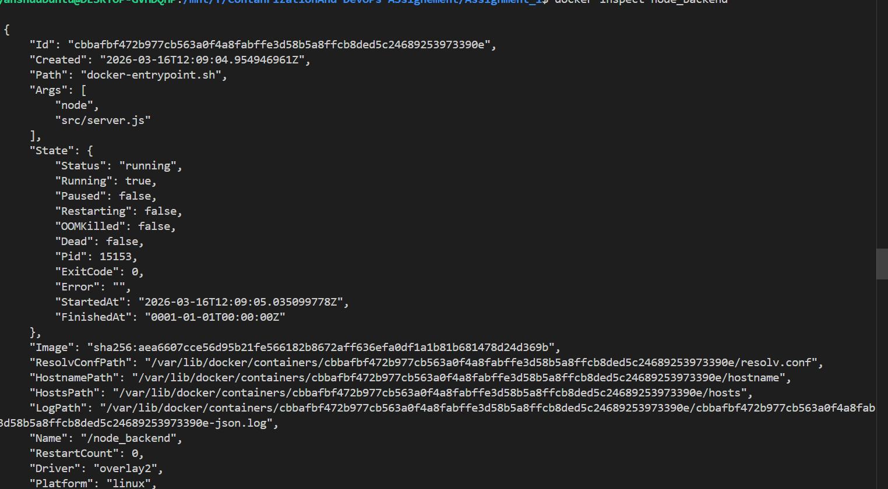


**Step-20:- Inspect DB**
```bash
docker inspect postgres_db
```
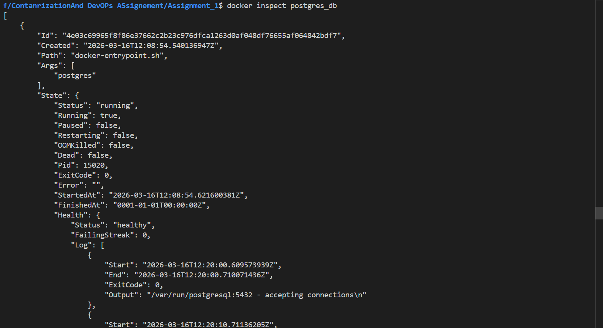


**Step-21:- Verify Data Persistence**
This step will verify that data stored in DB is permanently saved irrespective of the state of the container.
```bash
docker-compose down
docker-compose up -d
curl http://192.168.50.20:3000/users
```
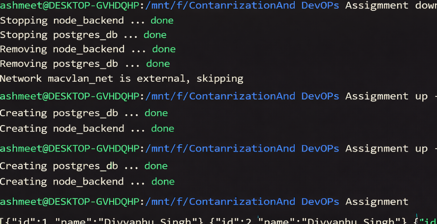


<hr>

<h4 align="center"> Report </h4>

<hr>


**_Build Optimization Explanation_**

Several techniques were applied during the Docker image build process to improve efficiency, security, and reduce the overall image size.

To begin with, the backend Dockerfile uses a multi-stage build strategy. In this method, dependencies are installed in an initial build stage, and only the required application files are transferred to the final runtime stage. This approach avoids including unnecessary build tools and intermediate files in the final image, which significantly reduces the image size.

Another optimization was the use of a lightweight base image (node:20-alpine) instead of the standard Node.js image. Alpine Linux is designed to be minimal, which helps in keeping the container size small. A smaller base image also improves container startup speed and reduces download time.

Additionally, a .dockerignore file was configured to prevent unnecessary files from being sent to the Docker build context. Files and folders such as node_modules, .git, and log files were excluded. This helps speed up the build process and ensures that only relevant application files are included in the image.

Lastly, the container is configured to run under a non-root user account. Avoiding root privileges inside containers improves security by limiting the impact of potential vulnerabilities or attacks.


<br>

**_Network Design Diagram_**

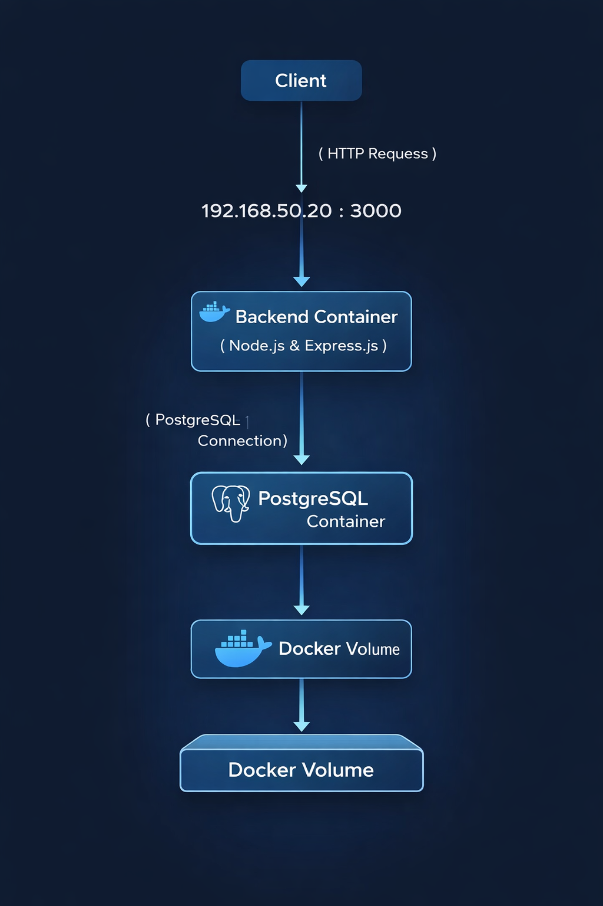


<br>


**_Image Size Comparison_**


The choice of base image can have a major impact on the final Docker image size.

node:20 → approximately 1.1 GB

node:20-alpine → approximately 180 MB

The Alpine-based image is significantly smaller than the default Node.js image. Because of this, it requires less storage, downloads faster, and allows containers to start more quickly.

For these reasons, the node:20-alpine image was selected for this project to keep the container lightweight and optimized.


**_Macvlan Vs IPvlan_**
| Feature | MACVLAN | IPVLAN |
|--------|---------|--------|
| MAC addresses | One per container | One shared for all |
| Network switch load | Higher (learns many MACs) | Lower (one MAC) |
| Scalability | Limited by switch | Much higher |
| Best for | Small deployments | Large-scale |